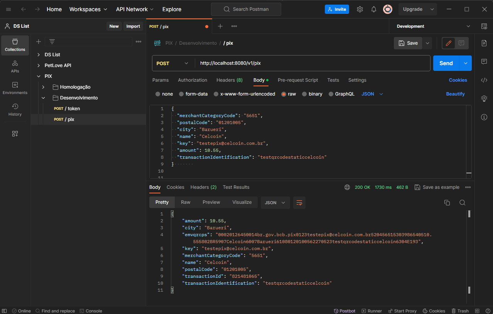

# REST QR Code PIX API

Este projeto foi desenvolvido usando Quarkus e Java 17 e oferece uma integração eficiente com os serviços da Celcoin (https://www.celcoin.com.br/) possibilitando a geração simplificada de QR Codes para transações PIX. 

Este projeto proporciona uma solução ágil e flexível para implementação de funcionalidades relacionadas ao PIX, utilizando a estrutura poderosa do Quarkus para construir uma API robusta e de alto desempenho.

A documentação detalhada, disponibilizada através do Swagger, facilita a compreensão e utilização dos endpoints, garantindo uma experiência amigável para desenvolvedores que desejam explorar e integrar os recursos do PIX fornecidos pela Celcoin.

## Configurar o ambiente de desenvolvimento

Para que o serviço de persistência funcione corretamente, você precisa personalizar as credenciais de acesso ao banco de dados do PostgreSQL. Para fazer isso, acesse o arquivo **application.properties** e ajuste as seguintes propriedades:

```properties
quarkus.datasource.username=${user.name}
quarkus.datasource.password=${user.password}
quarkus.datasource.jdbc.url=jdbc:postgresql://localhost:5432/${database.name}
```

## Executar projeto

Depois de baixar o projeto em seu computador, instalar as dependências e configurar o ambiente de desenvolvimento, basta executar o seguinte comando no terminal:
```shell script
./mvnw quarkus:dev
```

## Requisições com Postman

Você pode testar as requisições através do Postman. Para começar, basta baixar o arquivo **PIX.postman_collection.json** disponível na pasta **postman**, localizada na raiz do projeto. 

Este arquivo contém uma coleção predefinida com requisições relacionadas ao PIX. Ao importar este arquivo no aplicativo do Postman, você terá acesso imediato a um conjunto de requisições configuradas, simplificando o processo de teste e validação da API.

Ainda, você pode simplesmente enviar uma requisição **POST** para o endereço: **http://localhost:8080/v1/pix**, contendo a seguinte estrutura JSON:

```json
{
  "merchantCategoryCode": "5651",
  "postalCode": "01201005",
  "city": "Barueri",
  "name": "Celcoin",
  "key": "testepix@celcoin.com.br",
  "amount": 10.55,
  "transactionIdentification": "testqrcodestaticcelcoin"
}

```

O resultado será semelhante à imagem abaixo:



## Requisições e documentação com Swagger

O Swagger foi incorporado à aplicação para fornecer uma documentação detalhada e interativa dos endpoints. No Swagger, você encontrará um teste de requisição pronto para uso na rota principal responsável por gerar o QR Code do PIX. Essa funcionalidade agiliza o processo de teste e validação.

Para acessar o swagger, abra seu navegador favorito e vá para: **http://localhost:8080/swagger-ui/**

